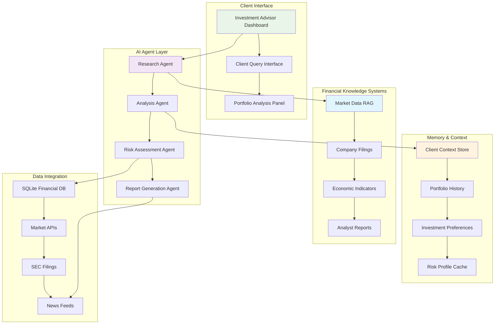
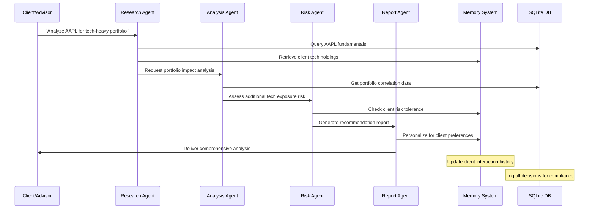
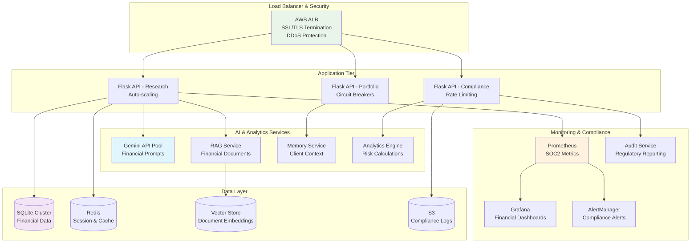

# Financial Services AI Pod: Investment Research Platform
## 💰 Project Overview - Building the Future of Investment Analysis

**Mission**: Create an AI-powered investment research platform that combines the latest financial AI trends with production-ready deployment practices.

**Industry Context**: 91% of financial services companies are using AI in production, with 37% focused on report generation, synthesis, and investment research to cut down on repetitive manual work.

---

## 🎯 Learning Objectives

By the end of 4 hours, each pair will have built and deployed:
- ✅ **Multi-agent investment analysis system** with market intelligence
- ✅ **RAG-powered financial research platform** with real-time data retrieval
- ✅ **Context-aware client conversations** with portfolio memory
- ✅ **Production deployment** with SOC2-compliant security and monitoring

---

## 🏗️ System Architecture



---

## 👥 User Stories & Success Criteria

### 💼 As an Investment Advisor
| User Story | Acceptance Criteria | Technical Implementation |
|------------|-------------------|-------------------------|
| **Client Research** | "I can ask about any stock/sector and get comprehensive analysis with sources" | Multi-agent research with RAG retrieval from financial documents |
| **Portfolio Analysis** | "I receive detailed portfolio health scores with risk assessments and recommendations" | Analysis agent with risk scoring algorithms + optimization suggestions |
| **Market Intelligence** | "I get real-time market insights and trend analysis for client discussions" | Knowledge agent with market data integration + sentiment analysis |
| **Report Generation** | "I can generate professional investment reports in minutes, not hours" | Report agent with templated output + client customization |

### 👤 As a Client
| User Story | Acceptance Criteria | Technical Implementation |
|------------|-------------------|-------------------------|
| **Investment Guidance** | "I can discuss my portfolio in natural language and get personalized advice" | Context-aware conversation with client history + preference learning |
| **Risk Understanding** | "I receive clear explanations of investment risks in terms I understand" | Risk assessment with plain-language explanations + visualization |
| **Performance Tracking** | "I can see how my investments are performing with actionable insights" | Real-time portfolio analysis with performance attribution |

### 🏛️ As a Compliance Officer
| User Story | Acceptance Criteria | Technical Implementation |
|------------|-------------------|-------------------------|
| **Audit Trail** | "All investment recommendations are logged with reasoning and sources" | SOC2-compliant logging + decision audit trails |
| **Risk Monitoring** | "I can track advisor-client interactions for compliance violations" | Automated compliance checking + escalation alerts |

---

## 🛠️ What You'll Receive (Instructor-Provided Foundation)

### 📦 Starter Kit Contents

#### 🐍 Backend Infrastructure (`/backend`)
```python
# Flask API with financial data integration
├── app.py                      # Main Flask application with auth
├── models/
│   ├── client.py              # Client profiles with encrypted PII
│   ├── portfolio.py           # Portfolio data models
│   ├── market_data.py         # Real-time market data handling
│   └── research.py            # Investment research storage
├── agents/
│   ├── research_agent.py      # Market research and analysis
│   ├── risk_agent.py          # Portfolio risk assessment
│   ├── report_agent.py        # Automated report generation
│   └── compliance_agent.py    # Regulatory compliance checking
└── database/
    ├── financial_data.db      # Pre-populated SQLite database
    ├── schema.sql             # Database structure
    └── seed_data.sql          # Sample financial data
```

#### ⚛️ Frontend Components (`/frontend`)
```javascript
// React components for investment platform
├── src/
│   ├── components/
│   │   ├── ResearchInterface.jsx    # AI-powered research chat
│   │   ├── PortfolioDashboard.jsx   # Real-time portfolio view
│   │   ├── RiskAnalysis.jsx         # Risk visualization
│   │   ├── ReportGenerator.jsx      # Automated report creation
│   │   └── ComplianceMonitor.jsx    # Compliance tracking
│   ├── services/
│   │   ├── marketAPI.js             # Market data integration
│   │   ├── researchAPI.js           # Research agent communication
│   │   └── portfolioAPI.js          # Portfolio management
│   └── utils/
│       ├── financialCalcs.js        # Financial calculations
│       └── chartUtils.js            # Data visualization helpers
```

#### 🏦 SQLite Financial Database Structure

| Table | Contents | Sample Size |
|-------|----------|------------|
| **stocks** | Company data, financial metrics, sector classification | 500 major stocks |
| **market_data** | Historical prices, volumes, financial ratios | 5 years daily data |
| **earnings** | Quarterly earnings, revenue, growth metrics | 2,000+ earnings reports |
| **analyst_reports** | Investment recommendations, target prices | 1,000+ analyst notes |
| **economic_indicators** | GDP, inflation, interest rates, unemployment | 10 years monthly data |
| **sec_filings** | 10-K, 10-Q summaries and key excerpts | 500+ recent filings |
| **client_portfolios** | Sample client holdings and preferences | 50 mock client profiles |

```sql
-- Sample schema excerpt
CREATE TABLE stocks (
    ticker TEXT PRIMARY KEY,
    company_name TEXT NOT NULL,
    sector TEXT,
    market_cap REAL,
    pe_ratio REAL,
    dividend_yield REAL,
    beta REAL,
    description TEXT
);

CREATE TABLE market_data (
    ticker TEXT,
    date DATE,
    open_price REAL,
    close_price REAL,
    volume INTEGER,
    rsi REAL,
    moving_avg_50 REAL,
    moving_avg_200 REAL
);
```

#### 🤖 AI Agent Framework
```python
# Pre-built agent classes for financial analysis
class ResearchAgent:
    """Conducts comprehensive investment research"""
    - Company fundamental analysis
    - Sector comparison and trends
    - Technical indicator interpretation
    - News sentiment analysis

class RiskAssessmentAgent:
    """Evaluates portfolio and investment risks"""
    - Portfolio diversification analysis
    - Value-at-Risk calculations
    - Stress testing scenarios
    - Risk-adjusted return metrics

class ReportGenerationAgent:
    """Creates professional investment reports"""
    - Executive summary generation
    - Data visualization selection
    - Compliance disclaimer insertion
    - Client-specific customization

class ComplianceAgent:
    """Ensures regulatory compliance"""
    - Suitability checking
    - Conflict of interest detection
    - Documentation requirements
    - Audit trail maintenance
```

---

## 🚀 4-Hour Implementation Sprint

### ⏰ Phase 1: Setup & Basic Research Chat (30 minutes)

#### 🎯 Sprint Goals
- [ ] Environment setup and Gemini API integration
- [ ] Basic financial research conversation flow
- [ ] SQLite database connection and querying

#### 🛠️ Technical Tasks
```bash
# Quick setup checklist
1. Clone financial research repository
2. Install dependencies: pip install -r requirements.txt && npm install
3. Initialize SQLite database: python init_db.py
4. Configure Gemini API with financial prompts: python test_research.py
5. Launch platform: npm start
```

#### 💡 AI-Assisted Development
```python
# Example: Customize the research agent
@ai_prompt_template
def investment_research_prompt(ticker, client_query):
    return f"""
    You are a professional investment research analyst. 
    Client asks: "{client_query}" about {ticker}
    
    Provide analysis covering:
    - Current financial health and key metrics
    - Recent performance vs sector and market
    - Key risks and opportunities
    - Investment recommendation with reasoning
    
    Use data from the financial database. Be objective and cite sources.
    Tailor language to client's sophistication level.
    """
```

#### 🔍 Database Integration Example
```python
# Financial data retrieval
def get_stock_analysis(ticker):
    query = """
    SELECT s.*, m.close_price, m.rsi, m.moving_avg_50 
    FROM stocks s 
    JOIN market_data m ON s.ticker = m.ticker 
    WHERE s.ticker = ? AND m.date = (SELECT MAX(date) FROM market_data WHERE ticker = ?)
    """
    return execute_query(query, [ticker, ticker])
```

#### ✅ Success Metrics
- Advisor can query any stock and get intelligent responses
- System retrieves relevant financial data from SQLite database
- Research agent provides sourced investment insights

---

### ⏰ Phase 2: Investment Logic & Risk Analysis (30 minutes)

#### 🎯 Sprint Goals
- [ ] Implement portfolio risk assessment algorithms
- [ ] Add investment recommendation engine
- [ ] Create client suitability checking
- [ ] Build compliance monitoring framework

#### 🛠️ Technical Implementation
```python
# Portfolio risk assessment
class PortfolioRiskAnalyzer:
    def calculate_portfolio_metrics(self, holdings):
        total_value = sum([h['shares'] * h['current_price'] for h in holdings])
        
        # Calculate key risk metrics
        metrics = {
            'portfolio_beta': self.calculate_weighted_beta(holdings),
            'sector_concentration': self.analyze_sector_concentration(holdings),
            'var_95': self.calculate_value_at_risk(holdings, 0.95),
            'sharpe_ratio': self.calculate_sharpe_ratio(holdings),
            'diversification_score': self.assess_diversification(holdings)
        }
        
        # Generate risk recommendations
        recommendations = self.generate_risk_recommendations(metrics)
        
        return {
            'total_value': total_value,
            'risk_metrics': metrics,
            'risk_level': self.categorize_risk_level(metrics),
            'recommendations': recommendations
        }
```

#### 📊 Investment Decision Engine
| Decision Factor | Weight | Data Source | Algorithm |
|----------------|--------|-------------|-----------|
| **Financial Health** | 30% | Company financials | Debt-to-equity, ROE, profit margins |
| **Technical Momentum** | 25% | Price/volume data | RSI, moving averages, trend analysis |
| **Valuation** | 25% | Market metrics | P/E ratio, PEG ratio, price-to-book |
| **Market Sentiment** | 20% | Analyst reports | Consensus ratings, target prices |

#### 🔒 Compliance Framework
```python
# SOC2-compliant activity logging
class ComplianceLogger:
    def log_investment_recommendation(self, advisor_id, client_id, recommendation):
        audit_entry = {
            'timestamp': datetime.utcnow(),
            'advisor_id': advisor_id,
            'client_id': client_id,
            'action': 'investment_recommendation',
            'recommendation': recommendation,
            'reasoning': recommendation['ai_reasoning'],
            'data_sources': recommendation['sources'],
            'risk_disclosures': self.get_required_disclosures(recommendation)
        }
        self.secure_log_store.insert(audit_entry)
```

#### ✅ Success Metrics
- Portfolio risk scores calculated accurately
- Investment recommendations based on multiple factors
- All advisor actions logged for compliance

---

### ⏰ Phase 3: RAG + Memory + Multi-Agent Orchestration (90 minutes)

#### 🎯 Sprint Goals - Advanced Financial Intelligence
- [ ] Build comprehensive financial document RAG system
- [ ] Implement persistent client memory and preferences
- [ ] Create sophisticated multi-agent investment workflow
- [ ] Add real-time market intelligence integration

#### 🧠 Financial RAG Implementation
```python
# Advanced financial RAG with multiple data sources
class FinancialRAGSystem:
    def __init__(self):
        self.vector_store = ChromaDB(collection_name="financial_docs")
        self.sqlite_connector = SQLiteConnector("financial_data.db")
        self.embeddings_model = SentenceTransformer('all-MiniLM-L6-v2')
        
    def hybrid_financial_search(self, query, client_context):
        # Combine structured data + document search + market intelligence
        structured_results = self.sql_search(query)
        document_results = self.semantic_document_search(query)
        market_results = self.real_time_market_search(query)
        
        # Weight results based on query type and client preferences
        return self.rank_and_synthesize(
            structured_results, 
            document_results, 
            market_results,
            client_context
        )
        
    def generate_investment_insight(self, results, client_risk_profile):
        # AI synthesis of multiple data sources
        context = f"""
        Financial Data: {results['structured']}
        Research Documents: {results['documents']}
        Market Intelligence: {results['market']}
        Client Risk Tolerance: {client_risk_profile}
        """
        
        return self.gemini_client.generate_insight(context)
```

#### 🎭 Multi-Agent Investment Workflow


#### 💾 Advanced Client Memory Architecture
43% of financial services professionals indicated that AI had improved their operational efficiency, while 42% felt it had helped their business build a competitive advantage.

| Memory Type | Storage Method | Financial Use Case | Retention Period |
|-------------|----------------|-------------------|------------------|
| **Episodic** | Vector embeddings of investment discussions | Remember client concerns, past recommendations | 7 years (regulatory) |
| **Semantic** | Knowledge graph of investment relationships | Client portfolio patterns, sector preferences | Ongoing |
| **Procedural** | Interaction style preferences | Communication style, report format preferences | 5 years |
| **Working** | Session state for complex analysis | Multi-step research sessions, draft reports | Session only |

```python
# Client memory integration for personalized advice
class ClientMemoryManager:
    def update_client_context(self, client_id, interaction):
        # Store investment preferences and concerns
        self.episodic_store.add_investment_discussion(client_id, interaction)
        
        # Learn portfolio patterns and risk tolerance
        investment_patterns = self.extract_investment_patterns(interaction)
        self.semantic_graph.update_client_profile(client_id, investment_patterns)
        
        # Adapt communication style
        communication_prefs = self.analyze_client_communication(interaction)
        self.procedural_store.update_preferences(client_id, communication_prefs)
        
    def get_personalized_investment_context(self, client_id, current_query):
        return {
            'investment_history': self.episodic_store.get_relevant_discussions(client_id, current_query),
            'portfolio_patterns': self.semantic_graph.get_client_investment_patterns(client_id),
            'communication_style': self.procedural_store.get_client_preferences(client_id),
            'risk_profile': self.get_current_risk_assessment(client_id)
        }
```

#### 📈 Real-Time Market Intelligence
```python
# Market intelligence with sentiment analysis
class MarketIntelligenceAgent:
    def get_market_context(self, ticker, timeframe='1d'):
        market_data = {
            'price_movement': self.get_price_momentum(ticker, timeframe),
            'volume_analysis': self.analyze_volume_patterns(ticker),
            'sector_performance': self.get_sector_comparison(ticker),
            'news_sentiment': self.analyze_news_sentiment(ticker),
            'analyst_changes': self.get_recent_analyst_updates(ticker)
        }
        
        # AI synthesis of market conditions
        market_summary = self.synthesize_market_intelligence(market_data)
        
        return {
            'current_conditions': market_data,
            'ai_summary': market_summary,
            'investment_implications': self.generate_investment_implications(market_data)
        }
```

#### ✅ Success Metrics
- Multi-agent system provides comprehensive investment analysis
- Client context improves recommendation personalization
- RAG system retrieves relevant financial documents and data

---

### ⏰ Phase 4: Production Deployment & SOC2 Compliance (90 minutes)

#### 🎯 Sprint Goals - Enterprise Financial Platform
- [ ] Implement SOC2-compliant security architecture
- [ ] Deploy with comprehensive audit logging and monitoring
- [ ] Add financial regulatory compliance frameworks
- [ ] Create production-ready performance optimization

#### 🔒 SOC2 Compliance for Financial Services
```python
# Enterprise security for financial data
class FinancialSecurityManager:
    def __init__(self):
        self.encryption_service = AES256EncryptionService()
        self.audit_logger = SOC2AuditLogger()
        self.access_controller = FinancialAccessControl()
        self.data_classifier = PIIClassifier()
        
    def secure_financial_data(self, data, data_type):
        # Classify and encrypt sensitive financial information
        classification = self.data_classifier.classify(data, data_type)
        
        if classification in ['PII', 'FINANCIAL', 'PORTFOLIO']:
            encrypted_data = self.encryption_service.encrypt(data)
            
            # Log access for SOC2 compliance
            self.audit_logger.log_data_access(
                user_id=current_user.id,
                data_classification=classification,
                access_purpose=data_type,
                encryption_applied=True,
                timestamp=datetime.utcnow()
            )
            
            return encrypted_data
        
        return data
        
    def role_based_financial_access(self, user_role, requested_data):
        permissions = {
            'client': ['own_portfolio', 'own_reports', 'market_data'],
            'advisor': ['client_portfolios', 'research_tools', 'report_generation'],
            'compliance': ['audit_logs', 'risk_reports', 'advisor_activity'],
            'admin': ['system_config', 'user_management', 'full_audit_access']
        }
        return self.access_controller.verify_access(user_role, requested_data)
```

#### 📊 Financial Performance Monitoring Dashboard
Private equity firms that have adopted AI are realizing the benefits and increasing their investment level. CFOs at mid-size companies play a crucial role in driving AI adoption

```python
# Production monitoring for financial platform
class FinancialPlatformMonitoring:
    def __init__(self):
        self.metrics_collector = PrometheusCollector()
        self.alerting_system = PagerDutyIntegration()
        self.compliance_monitor = RegulatoryComplianceMonitor()
        
    def track_financial_platform_metrics(self):
        return {
            'research_accuracy': self.measure_research_quality(),
            'client_satisfaction': self.get_advisor_feedback_scores(),
            'response_latency': self.measure_ai_response_times(),
            'compliance_score': self.calculate_regulatory_compliance(),
            'data_freshness': self.check_market_data_timeliness(),
            'cost_per_analysis': self.calculate_analysis_costs()
        }
        
    def setup_financial_alerts(self):
        # Critical alerts for financial services
        self.alerting_system.add_alert(
            name="Research Quality Decline",
            condition="research_accuracy < 85%",
            action="notify_research_team"
        )
        
        self.alerting_system.add_alert(
            name="Compliance Violation Risk",
            condition="compliance_score < 95%",
            action="immediate_compliance_review"
        )
        
        self.alerting_system.add_alert(
            name="Market Data Stale",
            condition="data_freshness > 15_minutes",
            action="refresh_market_feeds"
        )
```

#### 🚀 Production Architecture for Financial Services


#### 💰 Cost Optimization for Financial Platform
| Cost Center | Optimization Strategy | Expected Savings |
|-------------|----------------------|------------------|
| **Gemini API Calls** | Intelligent caching + prompt optimization | 70% reduction |
| **Market Data Feeds** | Strategic data sourcing + refresh scheduling | 50% reduction |
| **Vector Database** | Efficient indexing + query optimization | 45% reduction |
| **Compliance Storage** | Data lifecycle management + compression | 40% reduction |

#### 📋 Regulatory Compliance Framework
```python
# Automated regulatory compliance monitoring
class RegulatoryComplianceEngine:
    def __init__(self):
        self.regulations = {
            'MiFID_II': MiFIDIIComplianceChecker(),
            'SEC_Rules': SECComplianceChecker(), 
            'FINRA': FINRAComplianceChecker(),
            'SOX': SOXComplianceChecker()
        }
        
    def check_investment_recommendation_compliance(self, recommendation, client_profile):
        violations = []
        
        # Check suitability requirements
        if not self.verify_suitability(recommendation, client_profile):
            violations.append("Suitability_Violation")
            
        # Verify disclosure requirements
        if not self.check_required_disclosures(recommendation):
            violations.append("Disclosure_Missing")
            
        # Monitor for conflicts of interest
        if self.detect_conflicts(recommendation):
            violations.append("Conflict_of_Interest")
            
        return {
            'compliant': len(violations) == 0,
            'violations': violations,
            'remediation_required': self.get_remediation_steps(violations)
        }
```

#### ✅ Production Readiness Checklist
- [ ] End-to-end encryption for all financial data
- [ ] SOC2 audit logging and compliance monitoring
- [ ] Auto-scaling for market volatility periods
- [ ] Real-time monitoring with financial KPIs
- [ ] Regulatory compliance automation
- [ ] Disaster recovery for financial continuity
- [ ] Sub-1s response time for market queries

---

## 🎯 Final Demo Requirements

### 🏆 Investment Platform Showcase

Each pair must demonstrate a complete investment advisory workflow:

1. **Client Research Query** (2 minutes)
   - Natural language investment question
   - Multi-agent research coordination
   - SQLite data integration with real-time analysis

2. **Portfolio Analysis Process** (2 minutes)
   - Risk assessment and recommendations
   - RAG-powered market intelligence
   - Compliance checking and documentation

3. **Production Capabilities** (1 minute)
   - SOC2 security features and audit trails
   - Performance monitoring dashboard
   - Cost optimization and scalability demo

### 📊 Evaluation Criteria

| Metric Category | Target | Measurement Method |
|----------------|--------|-------------------|
| **Technical Excellence** | All 4 pillars operational | Live functionality demo |
| **Financial Accuracy** | Relevant investment insights | Financial professional review |
| **User Experience** | Intuitive advisor workflow | Evaluator interaction test |
| **Compliance Readiness** | SOC2 audit trail complete | Compliance verification |
| **Innovation Factor** | Creative financial features | Peer and instructor scoring |

---

## 🌟 Bonus Challenges (For Advanced Pairs)

### 🔬 Advanced Financial Features
- **ESG Integration**: Environmental, Social, Governance scoring and filtering
- **Options Analysis**: Greeks calculation and options strategy recommendations
- **Alternative Investments**: REITs, commodities, cryptocurrency analysis
- **Stress Testing**: Portfolio performance under economic scenarios

### 🏅 Innovation Opportunities
AI startups captured a record 46.4% of total $209 billion raised in 2024, compared to less than 10% in 2014.

Consider implementing cutting-edge financial AI:
- **Sentiment Analysis**: News and social media sentiment impact on prices
- **Regime Detection**: Automated detection of market regime changes
- **Factor Analysis**: Multi-factor model attribution and risk decomposition
- **Behavioral Finance**: Client bias detection and mitigation

---

## 📚 Resources & Documentation

### 🔗 Essential Links
- **SQLite Financial Database**: Pre-populated with market data and research
- **Gemini API Financial Prompts**: Specialized templates for investment analysis
- **SOC2 Compliance Guide**: Financial services implementation checklist
- **Market Data Integration**: Real-time and historical data connectors

### 🆘 Getting Help
- **Technical Issues**: Instructor assistance for complex integrations
- **Financial Modeling**: Access to financial professional advisors
- **Regulatory Questions**: Compliance framework documentation
- **Performance Issues**: Database optimization and scaling guides

---

## 🎉 Project Impact & Career Opportunities

This financial AI project reflects real industry implementations where AI has improved operational efficiency by 43% and helped build competitive advantage for 42% of financial firms.

By completing this sprint, you'll have built enterprise-grade financial technology comparable to platforms used by major investment firms, positioning you for high-growth roles in the $209 billion AI investment sector.

**Ready to revolutionize investment research with AI? Let's build the future of financial services! 📈**